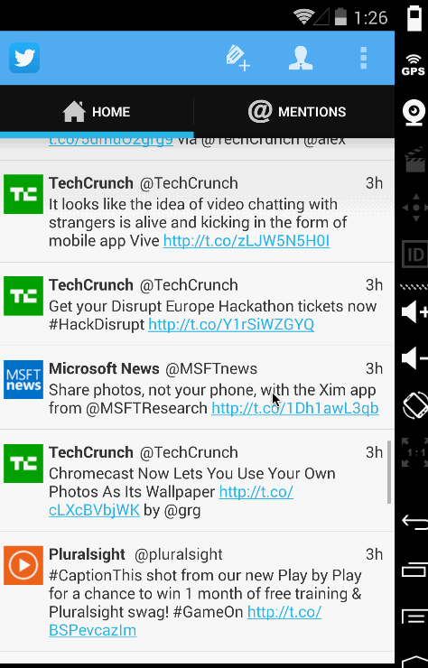
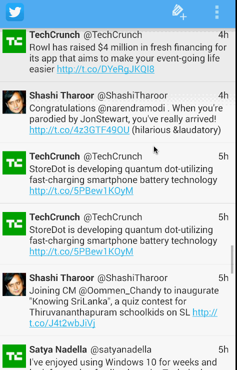

Twitter Client (Week 2)
=======================

Use cases supported
- User can switch between Timeline and Mention views using tabs.
- User can view their home timeline tweets.
- User can view the recent mentions of their username.
- User can scroll to bottom of either of these lists and new tweets will load ("infinite scroll")
- User can navigate to view their own profile
- User can see picture, # of followers, # of following, and tweets on their profile.
- User can click on the profile image in any tweet to see another user's profile.
- User can see picture, tagline, # of followers, # of following, and tweets of clicked user.
- Profile view should include that user's timeline

Twitter Client (Week 1)
=======================

Use cases supported
- User can sign in to Twitter using OAuth login
- User can view the tweets from their home timeline
- User should be displayed the username, name, and body for each tweet
- User should be displayed the relative timestamp for each tweet "8m", "7h"
- User can view more tweets as they scroll with infinite pagination
- Links in tweets are clickable and will launch the web browser (see autolink)
- User can compose a new tweet
- User can click a “Compose” icon in the Action Bar on the top right
- User can then enter a new tweet and post this to twitter
- User can see a counter with total number of characters left for tweet
- Improve the user interface and theme the app to feel "twitter branded"

